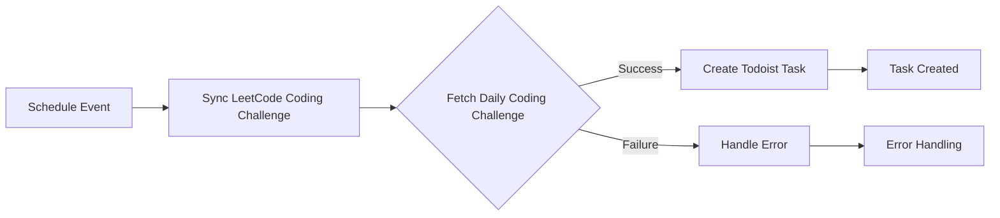

<h2 align="center">TodoLeet</h1>

<p align="center">
  
</p>

<div align="center">Syncs Daily LeetCoding Challenge to Todoist.</div>

[](https://github.com/ngshiheng/todoleet/actions/workflows/ci.yml)
[](https://github.com/ngshiheng/todoleet/actions/workflows/release.yml)

## Table of Contents

- [Table of Contents](#table-of-contents)
- [Context](#context)
- [Requirements](#requirements)
- [Installation](#installation)
- [Usage](#usage)
- [Deployment](#deployment)
  - [Wrangler CLI](#wrangler-cli)
- [Contributing](#contributing)
- [References](#references)
- [FAQ](#faq)
  - [Is it safe to publish wrangler.toml with `account_id`?](#is-it-safe-to-publish-wranglertoml-with-account_id)

## Context



A [Cloudflare Worker](https://developers.cloudflare.com/workers/) project that syncs Daily LeetCoding Challenge to your [Todoist](https://todoist.com/). The worker runs every day at [00:01 UTC](https://crontab.guru/#1_0_*_*_*) and syncs the Daily LeetCoding Challenge to your Todoist.

[Read more...](https://jerrynsh.com/how-i-sync-daily-leetcoding-challenge-to-todoist/).

## Requirements

-   A Cloudflare account
-   Install [Wrangler](https://github.com/cloudflare/wrangler#installation) CLI for Cloudflare Workers deployment

## Installation

The dependencies are only used for development. So the installation is not required.

```sh
npm ci
```

## Usage

To test out the cron trigger locally, run the following:

```sh
# 1. set TODOIST_API_TOKEN
wrangler login
wrangler secret put TODOIST_API_TOKEN

# 2. run worker
npm run dev # wrangler dev --test-scheduled --remote

# 3. test scheduled event.
curl "http://localhost:8787/__scheduled"

# 4. check if a new task is created on your Todoist
```

## Deployment

### Wrangler CLI

1. Add `TODOIST_API_TOKEN` using `wrangler secret put TODOIST_API_TOKEN`. You may find the newly added secret under `Cloudflare Worker` -> `Settings` -> `Variables`. You can get your Todoist API token from https://app.todoist.com/app/settings/integrations/developer.

2. This is only required for [Wrangler actions](https://github.com/marketplace/actions/deploy-to-cloudflare-workers-with-wrangler). Add `CF_API_TOKEN` into your GitHub repository secrets. You can create your API token from https://dash.cloudflare.com/profile/api-tokens using the `Edit Cloudflare Workers` template.

3. To publish any new changes to your Cloudflare Worker, run `wrangler deploy`

## Contributing

Pull requests are welcome. For major changes, please open an issue first to discuss what you would like to change.

1. Fork this
2. Create your feature branch (`git checkout -b tommy/fooBar`)
3. Commit your changes (`git commit -am 'feat: add some fooBar'`, make sure that your commits are [semantic](https://gist.github.com/joshbuchea/6f47e86d2510bce28f8e7f42ae84c716))
4. Push to the branch (`git push origin tommy/fooBar`)
5. Create a new Pull Request

## References

-   https://developer.todoist.com/guides/
-   https://developers.cloudflare.com/workers/

## FAQ

### Is it safe to publish wrangler.toml with `account_id`?

[Yes](https://github.com/cloudflare/wrangler/issues/209#issuecomment-541654484).
